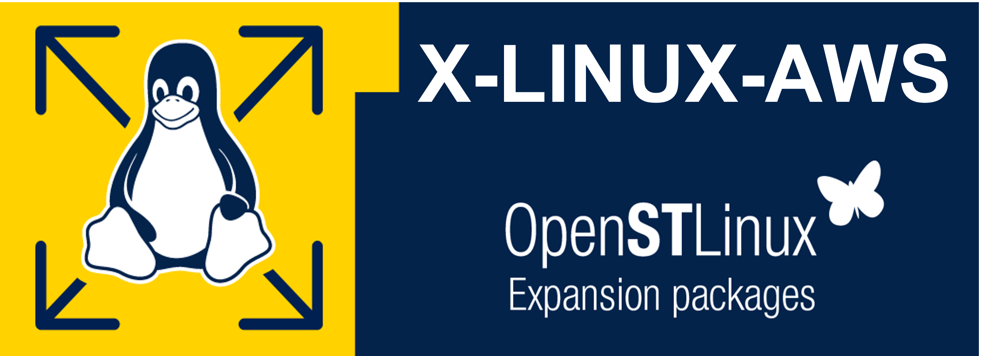

    

X-LINUX-AWS is an STM32 MPU OpenSTLinux Expansion Package that targets Amazon Web Services® AWS IoT GreengrassTM V2 for STM32MP13 product microprocessors.  

It integrates the Greengrass nucleus component to connect to AWS IoT CoreTM to start and accelerate the development of an IoT solution.  

In addition, this OpenSTLinux Expansion Package provides good security practices with the integration of a secure solution for credential storage. This solution is based on the usage of OP-TEE and TPM.  

X-LINUX-AWS includes a demonstration application in which the AWS IoT GreengrassTM core device subscribes and publishes on a local MQTT network and on AWS IoT CoreTM. This is achieved through the component deployment of an MQTT broker and bridge.

- AWS IoT GreengrassTM V2 integration
- Secured credential storage with OP-TEE or STPM4RasPI extension board
- Application sample based on GTK® to publish and subscribe on MQTT topics

# meta-st-x-linux-aws
X-LINUX-AWS OpenEmbedded meta layer to be integrated into OpenSTLinux distribution.
It contains recipes for Amazon Web Services® IoT GreengrassTM v2, OP-TEE, TPM and application example.

## Compatibility
The X-LINUX-AWS OpenSTLinux Expansion Package v5.0.0 is compatible with the Yocto Project™ build system Mickledore.
It is validated over the OpenSTLinux Distribution v5.0 on STM32MP135F-DK.

## Versioning
Since its release v5.0.0, the major versioning of the X-LINUX-AWS OpenSTLinux Expansion Package is aligned on the major versioning of the OpenSTLinux Distribution. This prevents painful backward compatibility attempts and makes dependencies straightforward.
The X-LINUX-AWS generic versioning v**x**.**y**.**z** is built as follows:
* **x**: major version matching the OpenSTLinux Distribution major version. Each new major version is incompatible with previous OpenSTLinux Distribution versions.
* **y**: minor version, which is changed when new functionalities are added to the X-LINUX-AWS OpenSTLinux Expansion Package in a backward compatible manner.
* **z**: patch version to introduce bug fixes. A patch version is implemented in a backward compatible manner.

## Further information on X-LINUX-AWS Expansion Package
<https://wiki.st.com/stm32mpu/wiki/X-LINUX-AWS_Expansion_Package>

## Further information on how to install and how to use X-LINUX-AWS Starter package
<https://wiki.st.com/stm32mpu/wiki/X-LINUX-AWS_Starter_package>

## Further information on how to install and how to use X-LINUX-AWS Distribution package
<https://wiki.st.com/stm32mpu/wiki/X-LINUX-AWS_Distribution_package>

